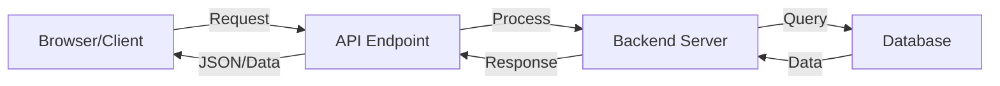

# Backend Development Guide

A comprehensive guide to building backend applications with Node.js, Express, MongoDB, and more.

## Table of Contents

- [Introduction](#introduction)
- [Backend Basics](#backend-basics)
- [Project Structure](#project-structure)
- [Express Setup](#express-setup)
- [Database Connection](#database-connection)
- [Models](#models)
  - [User Model](#user-model)
  - [Video Model](#video-model)
  - [Subscription Model](#subscription-model)
- [Authentication](#authentication)
  - [JWT Tokens](#jwt-tokens)
  - [Password Hashing](#password-hashing)
- [File Uploads](#file-uploads)
  - [Multer](#multer)
  - [Cloudinary](#cloudinary)
- [Middleware](#middleware)
- [Routes and Controllers](#routes-and-controllers)
- [MongoDB Aggregation Pipelines](#mongodb-aggregation-pipelines)
- [CORS and Security](#cors-and-security)
- [Project Implementation Steps](#project-implementation-steps)

## Introduction

This guide covers the fundamentals of building a backend server using Node.js, Express, and MongoDB. It includes authentication, file uploads, database modeling, and more.

## Backend Basics

A server is software that serves something. The backend handles requests from clients (browsers) and communicates with databases to store and retrieve data.

### Working of Backend:



The backend can also interact with:
- Files
- Third-party APIs
- Other services

## Project Structure

A well-organized backend project typically includes:


├── package.json
├── .env
├── README.md
├── .gitignore
└── src/
├── index.js        # Entry point, DB connection
├── app.js          # Express configuration
├── constants.js    # Enums, DB names, etc.
├── db/             # Database connection
├── models/         # Data structure definitions
├── controllers/    # Business logic
├── routes/         # API endpoints
├── middlewares/    # Request processors
└── utils/          # Helper functions


## Express Setup

Express.js is a web framework for Node.js that simplifies building APIs.

### Basic Express Server

```javascript
const express = require('express');
const app = express();
const PORT = process.env.PORT || 3000;

app.get('/', (req, res) => {
  res.send('Hello World!');
});

app.listen(PORT, () => {
  console.log(`Server running on port ${PORT}`);
});
```

### Production Setup

```javascript
// app.js
const express = require('express');
const cors = require('cors');
const cookieParser = require('cookie-parser');

const app = express();

// Middleware
app.use(cors({
  origin: process.env.CORS_ORIGIN,
  credentials: true
}));
app.use(express.json({ limit: '16kb' }));
app.use(express.urlencoded({ extended: true, limit: '16kb' }));
app.use(express.static('public'));
app.use(cookieParser());

// Routes
import userRouter from './routes/user.routes.js';
app.use('/api/v1/users', userRouter);

export default app;
```

## Database Connection

### MongoDB with Mongoose

```javascript
// db/index.js
import mongoose from 'mongoose';
import { DB_NAME } from '../constants.js';

const connectDB = async () => {
  try {
    const connectionInstance = await mongoose.connect(`${process.env.MONGODB_URI}/${DB_NAME}`);
    console.log(`MongoDB connected! DB Host: ${connectionInstance.connection.host}`);
  } catch (error) {
    console.error("MongoDB connection error:", error);
    process.exit(1);
  }
};

export default connectDB;
```

```javascript
// index.js
import dotenv from 'dotenv';
import connectDB from './db/index.js';
import app from './app.js';

dotenv.config();

connectDB()
  .then(() => {
    app.listen(process.env.PORT || 4000, () => {
      console.log(`Server running on port ${process.env.PORT || 4000}`);
    });
  })
  .catch((err) => {
    console.error("MongoDB connection failed:", err);
  });
```

## Models

### User Model

```javascript
// models/user.model.js
import mongoose from 'mongoose';
import bcrypt from 'bcrypt';
import jwt from 'jsonwebtoken';

const userSchema = new mongoose.Schema({
  username: {
    type: String,
    required: true,
    unique: true,
    lowercase: true,
    trim: true,
    index: true
  },
  email: {
    type: String,
    required: true,
    unique: true,
    lowercase: true,
    trim: true
  },
  fullName: {
    type: String,
    required: true,
    trim: true,
    index: true
  },
  avatar: {
    type: String, // Cloudinary URL
    required: true
  },
  coverImage: {
    type: String // Cloudinary URL
  },
  password: {
    type: String,
    required: [true, 'Password is required'],
    minlength: 8
  },
  watchHistory: [{
    type: mongoose.Schema.Types.ObjectId,
    ref: "Video"
  }],
  refreshToken: {
    type: String
  }
}, { timestamps: true });

// Pre-save hook to hash password
userSchema.pre('save', async function(next) {
  if (!this.isModified('password')) return next();
  
  this.password = await bcrypt.hash(this.password, 10);
  next();
});

// Method to check password
userSchema.methods.isPasswordCorrect = async function(password) {
  return await bcrypt.compare(password, this.password);
};

// Generate access token
userSchema.methods.generateAccessToken = function() {
  return jwt.sign(
    {
      _id: this._id,
      email: this.email,
      username: this.username,
      fullName: this.fullName
    },
    process.env.ACCESS_TOKEN_SECRET,
    {
      expiresIn: process.env.ACCESS_TOKEN_EXPIRY
    }
  );
};

// Generate refresh token
userSchema.methods.generateRefreshToken = function() {
  return jwt.sign(
    {
      _id: this._id
    },
    process.env.REFRESH_TOKEN_SECRET,
    {
      expiresIn: process.env.REFRESH_TOKEN_EXPIRY
    }
  );
};

export const User = mongoose.model('User', userSchema);
```

### Video Model

```javascript
// models/video.model.js
import mongoose from 'mongoose';
import mongooseAggregatePaginate from 'mongoose-aggregate-paginate-v2';

const videoSchema = new mongoose.Schema({
  videoFile: {
    type: String, // Cloudinary URL
    required: true
  },
  thumbnail: {
    type: String, // Cloudinary URL
    required: true
  },
  title: {
    type: String,
    required: true
  },
  description: {
    type: String,
    required: true
  },
  duration: {
    type: Number,
    required: true
  },
  views: {
    type: Number,
    default: 0
  },
  isPublished: {
    type: Boolean,
    default: true
  },
  owner: {
    type: mongoose.Schema.Types.ObjectId,
    ref: "User"
  }
}, { timestamps: true });

videoSchema.plugin(mongooseAggregatePaginate);

export const Video = mongoose.model('Video', videoSchema);
```

### Subscription Model

```javascript
// models/subscription.model.js
import mongoose from 'mongoose';

const subscriptionSchema = new mongoose.Schema({
  subscriber: {
    type: mongoose.Schema.Types.ObjectId, // one who is subscribing
    ref: "User"
  },
  channel: {
    type: mongoose.Schema.Types.ObjectId, // one to whom subscriber is subscribing
    ref: "User"
  }
}, { timestamps: true });

export const Subscription = mongoose.model('Subscription', subscriptionSchema);
```

## Authentication

### JWT Tokens

JSON Web Tokens (JWT) are used for secure authentication:

| Feature | Tokens | Sessions | Cookies
|-----|-----|-----|-----
| Definition | A piece of data (usually JWT) used to authenticate and authorize users | A server-side mechanism that stores user state | Small data stored in the browser to remember user info
| Storage | Client-side (browser storage) | Server-side, with session ID on client | Browser (client-side)
| Usage | API authentication (stateless) | Maintain user state and login status | Store user preferences, authentication info
| Security | Can be signed and encrypted | More secure since data is on server | Vulnerable to XSS and CSRF if not set properly
| Lifetime | Has an expiration time | Exists until logout or expiration | Can be session-based or persistent
| Scalability | Highly scalable (stateless) | Requires session management | No direct impact on scalability


### Password Hashing

Using bcrypt to securely hash passwords:
```javascript
// Hashing password before saving
userSchema.pre('save', async function(next) {
  if (!this.isModified('password')) return next();
  
  this.password = await bcrypt.hash(this.password, 10);
  next();
});

// Verifying password
userSchema.methods.isPasswordCorrect = async function(password) {
  return await bcrypt.compare(password, this.password);
};
```

## File Uploads

### Multer

Multer is middleware for handling `multipart/form-data`, primarily used for file uploads:
```javascript
// middlewares/multer.middleware.js
import multer from 'multer';
import path from 'path';

const storage = multer.diskStorage({
  destination: function (req, file, cb) {
    cb(null, './public/temp');
  },
  filename: function (req, file, cb) {
    cb(null, file.originalname);
  }
});

export const upload = multer({ storage });
```

### Cloudinary

Cloudinary is used for cloud storage of images and videos:

```javascript

// utils/cloudinary.js
import { v2 as cloudinary } from 'cloudinary';
import fs from 'fs';

cloudinary.config({
  cloud_name: process.env.CLOUDINARY_CLOUD_NAME,
  api_key: process.env.CLOUDINARY_API_KEY,
  api_secret: process.env.CLOUDINARY_API_SECRET
});

const uploadOnCloudinary = async (localFilePath) => {
  try {
    if (!localFilePath) return null;
    
    // Upload file to cloudinary
    const response = await cloudinary.uploader.upload(localFilePath, {
      resource_type: "auto"
    });
    
    // File uploaded successfully
    fs.unlinkSync(localFilePath); // Remove locally saved file
    return response;
    
  } catch (error) {
    fs.unlinkSync(localFilePath); // Remove the locally saved file as upload failed
    return null;
  }
};

export { uploadOnCloudinary };```
```

## Middleware

### Authentication Middleware
```javascript
// middlewares/auth.middleware.js
import jwt from 'jsonwebtoken';
import { User } from '../models/user.model.js';
import { ApiError } from '../utils/ApiError.js';

export const verifyJWT = async (req, res, next) => {
  try {
    const token = req.cookies?.accessToken || req.header("Authorization")?.replace("Bearer ", "");
    
    if (!token) {
      throw new ApiError(401, "Unauthorized request");
    }
    
    const decodedToken = jwt.verify(token, process.env.ACCESS_TOKEN_SECRET);
    
    const user = await User.findById(decodedToken?._id).select("-password -refreshToken");
    
    if (!user) {
      throw new ApiError(401, "Invalid Access Token");
    }
    
    req.user = user;
    next();
    
  } catch (error) {
    throw new ApiError(401, error?.message || "Invalid access token");
  }
};
```

## Error Handler

```javascript
// utils/ApiError.js
class ApiError extends Error {
  constructor(
    statusCode,
    message = "Something went wrong",
    errors = [],
    stack = ""
  ) {
    super(message);
    this.statusCode = statusCode;
    this.data = null;
    this.message = message;
    this.success = false;
    this.errors = errors;

    if (stack) {
      this.stack = stack;
    } else {
      Error.captureStackTrace(this, this.constructor);
    }
  }
}

export { ApiError };
```


### Async Handler

```javascript

// utils/asyncHandler.js
const asyncHandler = (fn) => async (req, res, next) => {
  try {
    await fn(req, res, next);
  } catch (error) {
    res.status(error.statusCode || 500).json({
      success: false,
      message: error.message
    });
  }
};

export { asyncHandler };
```


## API Response
```javascript
// utils/ApiResponse.js
class ApiResponse {
  constructor(statusCode, data, message = "Success") {
    this.statusCode = statusCode;
    this.data = data;
    this.message = message;
    this.success = statusCode < 400;
  }
}

export { ApiResponse };
```

## Routes and Controllers

### User Routes

```javascript
// routes/user.routes.js
import { Router } from 'express';
import { 
  registerUser, 
  loginUser, 
  logoutUser, 
  refreshAccessToken,
  changePassword,
  getCurrentUser,
  updateUserDetails,
  getUserChannelProfile,
  getWatchHistory
} from '../controllers/user.controller.js';
import { upload } from '../middlewares/multer.middleware.js';
import { verifyJWT } from '../middlewares/auth.middleware.js';

const router = Router();

router.route('/register').post(
  upload.fields([
    { name: 'avatar', maxCount: 1 },
    { name: 'coverImage', maxCount: 1 }
  ]),
  registerUser
);

router.route('/login').post(loginUser);

// Secured routes
router.route('/logout').post(verifyJWT, logoutUser);
router.route('/refresh-token').post(refreshAccessToken);
router.route('/change-password').post(verifyJWT, changePassword);
router.route('/current-user').get(verifyJWT, getCurrentUser);
router.route('/update-account').patch(verifyJWT, updateUserDetails);
router.route('/c/:username').get(verifyJWT, getUserChannelProfile);
router.route('/history').get(verifyJWT, getWatchHistory);

export default router;
```

## User Controller

```javascript
// controllers/user.controller.js
import { asyncHandler } from '../utils/asyncHandler.js';
import { ApiError } from '../utils/ApiError.js';
import { User } from '../models/user.model.js';
import { uploadOnCloudinary } from '../utils/cloudinary.js';
import { ApiResponse } from '../utils/ApiResponse.js';
import jwt from 'jsonwebtoken';
import mongoose from 'mongoose';

const registerUser = asyncHandler(async (req, res) => {
  // Get user details
  const { fullName, email, username, password } = req.body;
  
  // Validation
  if ([fullName, email, username, password].some(field => field?.trim() === "")) {
    throw new ApiError(400, "All fields are required");
  }
  
  // Check if user already exists
  const existingUser = await User.findOne({
    $or: [{ username }, { email }]
  });
  
  if (existingUser) {
    throw new ApiError(409, "User with email or username already exists");
  }
  
  // Handle file uploads
  const avatarLocalPath = req.files?.avatar[0]?.path;
  const coverImageLocalPath = req.files?.coverImage?.[0]?.path;
  
  if (!avatarLocalPath) {
    throw new ApiError(400, "Avatar file is required");
  }
  
  // Upload to cloudinary
  const avatar = await uploadOnCloudinary(avatarLocalPath);
  const coverImage = coverImageLocalPath ? await uploadOnCloudinary(coverImageLocalPath) : null;
  
  if (!avatar) {
    throw new ApiError(500, "Avatar upload failed");
  }
  
  // Create user in database
  const user = await User.create({
    fullName,
    email,
    username: username.toLowerCase(),
    password,
    avatar: avatar.url,
    coverImage: coverImage?.url || ""
  });
  
  // Remove password and token from response
  const createdUser = await User.findById(user._id).select("-password -refreshToken");
  
  if (!createdUser) {
    throw new ApiError(500, "Something went wrong while registering user");
  }
  
  // Return response
  return res.status(201).json(
    new ApiResponse(201, createdUser, "User registered successfully")
  );
});

// Other controller methods...

export {
  registerUser,
  // Other exports...
};
```

## MongoDB Aggregation Pipelines

Aggregation pipelines are used for complex data operations:

```javascript
// Example: Get user channel profile with subscriber counts
const getUserChannelProfile = asyncHandler(async (req, res) => {
  const { username } = req.params;
  
  if (!username?.trim()) {
    throw new ApiError(400, "Username is missing");
  }
  
  const channel = await User.aggregate([
    {
      $match: {
        username: username.toLowerCase()
      }
    },
    {
      $lookup: {
        from: "subscriptions",
        localField: "_id",
        foreignField: "channel",
        as: "subscribers"
      }
    },
    {
      $lookup: {
        from: "subscriptions",
        localField: "_id",
        foreignField: "subscriber",
        as: "subscribedTo"
      }
    },
    {
      $addFields: {
        subscribersCount: {
          $size: "$subscribers"
        },
        channelsSubscribedToCount: {
          $size: "$subscribedTo"
        },
        isSubscribed: {
          $cond: {
            if: { $in: [req.user?._id, "$subscribers.subscriber"] },
            then: true,
            else: false
          }
        }
      }
    },
    {
      $project: {
        fullName: 1,
        username: 1,
        subscribersCount: 1,
        channelsSubscribedToCount: 1,
        isSubscribed: 1,
        avatar: 1,
        coverImage: 1,
        email: 1
      }
    }
  ]);
  
  if (!channel?.length) {
    throw new ApiError(404, "Channel does not exist");
  }
  
  return res.status(200).json(
    new ApiResponse(200, channel[0], "User channel fetched successfully")
  );
});
```

## CORS and Security

Cross-Origin Resource Sharing (CORS) is a security feature that restricts web pages from making requests to a different domain than the one that served the original page.
```javascript
// app.js
import cors from 'cors';

app.use(cors({
  origin: process.env.CORS_ORIGIN,
  credentials: true
}));
```

## Project Implementation Steps

### 1. **Database Connection**
1. Set up MongoDB connection in `index.js`.

### 2. **Application Setup**
1. Configure Express app in `app.js`.
2. Set up middleware, routes, and API versioning.

### 3. **Models**
1. Create User, Video, and Subscription models.
2. Implement pre-save hooks, password validation, and JWT generation.

### 4. **Authentication**
1. Implement JWT token-based authentication.
2. Set up refresh token mechanism.

### 5. **Controllers and Routes**
1. Implement user registration, login, and logout.
2. Create video upload and management.
3. Set up subscription handling.
4. Implement watch history using aggregation pipelines.

### 6. **Middleware & File Management**
1. Set up authentication middleware.
2. Configure Multer for file uploads.
3. Integrate Cloudinary for cloud storage.
